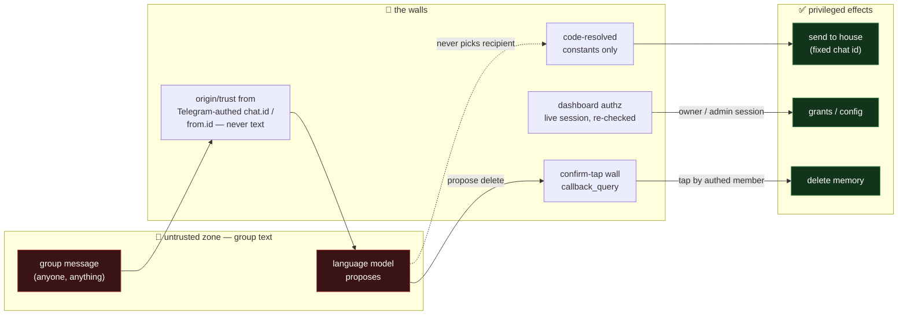
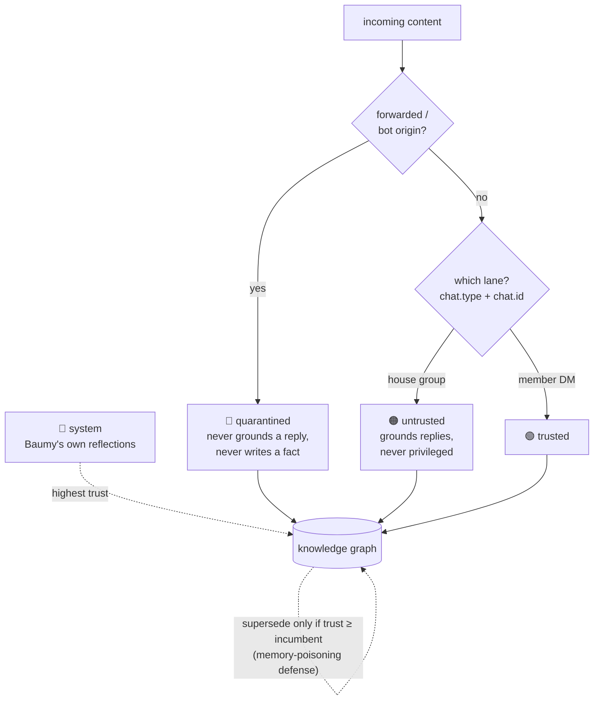
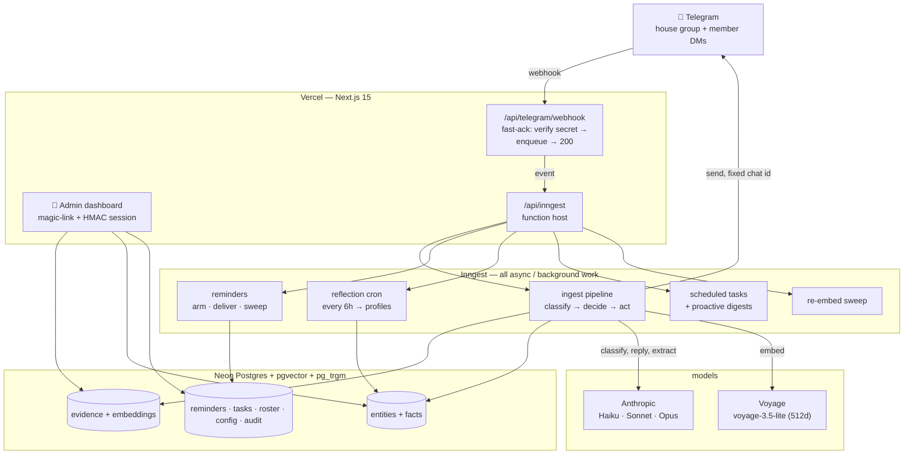
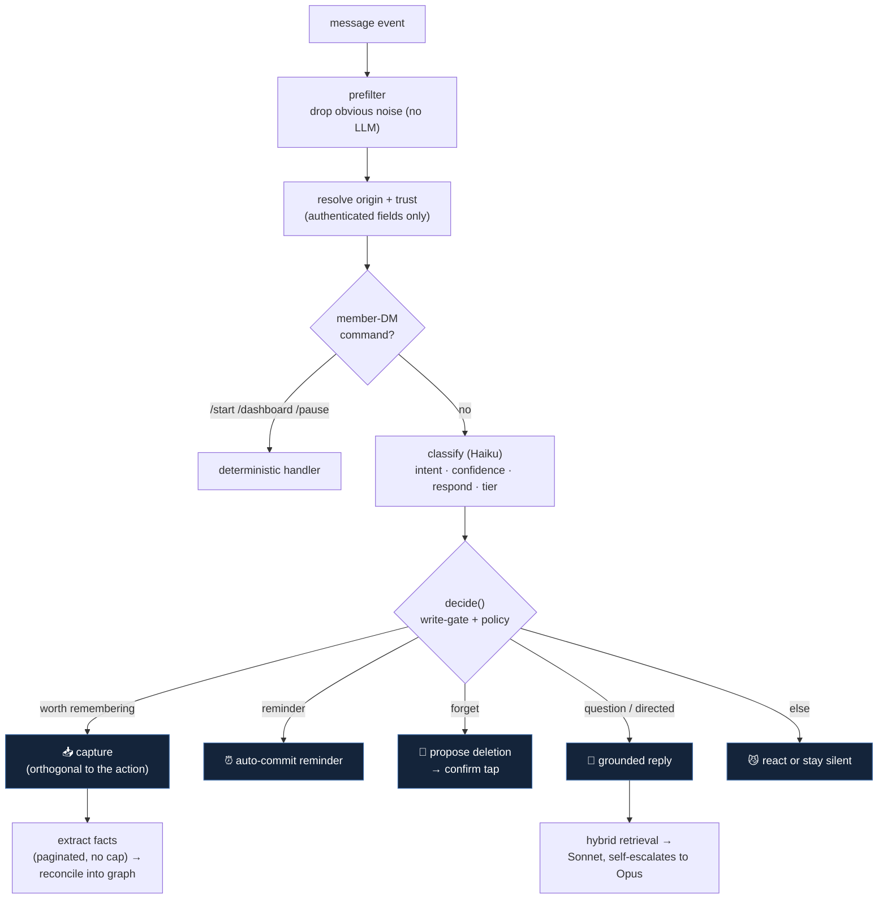
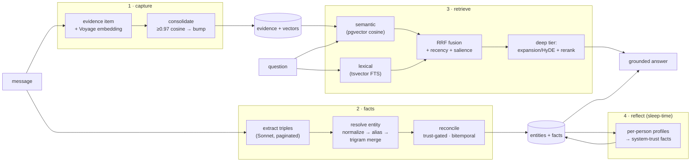
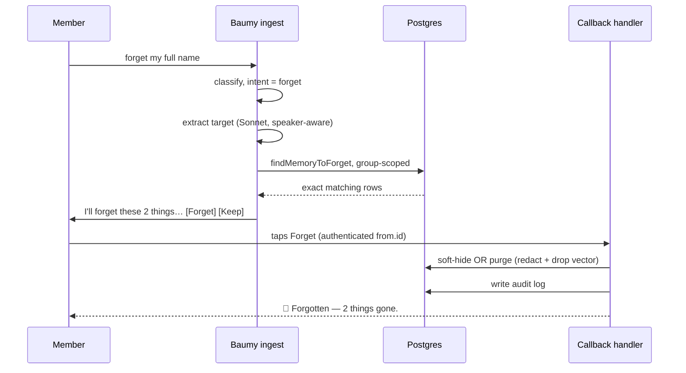
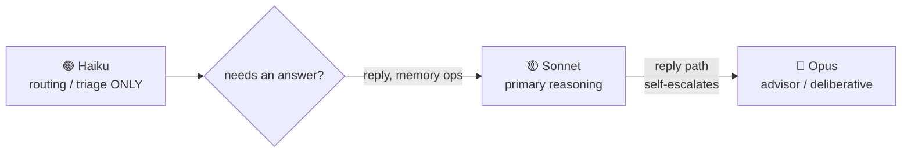

# 🐈‍⬛ Baumy Brain

> A private Telegram **house-management secretary** for one shared house — a memory-first
> group-chat gremlin that quietly remembers everything the house says, answers questions
> grounded in that memory, schedules reminders, learns the people who live there, and can
> forget things on request. It runs in the house group, reacts more than it talks, and
> never invents facts.

Baumy is **not** a personal assistant and **not** multi-tenant. It's one bot, one house,
one shared memory — built so the group chat has to remember *less*, not scroll more.

---

## What it does

| | |
|---|---|
| 🧠 **Remembers the house** | Every message is captured, embedded, and distilled into a trust-gated knowledge graph. Ask "who's in the cave this week?" months later and it knows. |
| 💬 **Answers, grounded** | Replies only from what the house actually said — with an *honest miss* when it doesn't know, never a hallucinated fact. Reacts (👀🧠👍) more than it speaks. |
| ⏰ **Reminders** | "remind us to pay rent friday" → DST-correct, exactly-once delivery to the house group. |
| 👥 **Learns people** | People are first-class entities — housemates, guests, the landlord — with relationships, notes, and attributed sentiment (never a score, never volunteered). |
| 🌙 **Reflects** | A sleep-time job consolidates what it knows into durable per-person profiles — the "it learns over time" step. |
| 🧽 **Forgets on request** | "forget my full name" → Baumy proposes exactly what it'll remove and only deletes on a confirm tap. Soft-hide (reversible) or hard-purge (right-to-be-forgotten). |
| 🔐 **Admin dashboard** | Telegram magic-link login → browse memory, manage reminders/tasks, grant access, tune the response policy. |

---

## The one idea that matters

Telegram privacy mode is **off**, so Baumy sees *every* group message — which means every
message is **untrusted, attacker-controlled input**. The entire design follows one rule:

> **The LLM proposes; deterministic code disposes.**

No path lets group text directly cause a privileged effect. A language model can *suggest*
an action, but the thing that *commits* is always a human authorization — a confirm tap
(deletes, reminders) or a live-authenticated dashboard session (grants, config) — or a
code-resolved constant (the fixed send destination).



**Trust tiers** are derived only from Telegram-authenticated fields, never message content:



---

## System architecture



**Why this shape:** the webhook is *fast-ack only* (verify → enqueue → 200); every real
decision happens downstream in Inngest, where retries, exactly-once claims, and idempotency
live. Scope (house vs DM vs ignore) is resolved from stored config, never guessed.

---

## The ingest pipeline

Every group message walks the same gauntlet. The **write-gate** (`decide`) is where the
classifier's *proposal* becomes a code-*disposed* action, clamped by an origin↔action policy.



Capture is **orthogonal** to the action: a message can set a reminder *and* state a durable
fact ("Zuzana arrives 10pm, staying in my room") — both are kept. Every structured-output
call on this path is **best-effort** — a malformed model response degrades to a safe default
instead of crash-looping the pipeline.

---

## The memory pipeline — the crown jewel



- **Capture** stores the raw message + embedding; a near-verbatim restatement *consolidates*
  onto the original (salience bump) instead of duplicating.
- **Facts** distils `{subject, predicate, object}` triples into a **trust-gated, bitemporal**
  graph. People are first-class; entity resolution de-fragments surface forms ("the sink" /
  "kitchen sink" → one node) while keeping distinct people distinct.
- **Retrieve** fuses semantic ⊕ lexical recall via **Reciprocal Rank Fusion**, composes
  recency + salience, and on the deep tier adds query expansion/HyDE and a re-rank.
- **Reflect** runs on a slow cron: it re-reads a person's own facts + notes and writes a
  durable profile back as a `system`-trust fact — from **non-secret, non-quarantined**
  material (already-captured evidence + facts, not live group text; secrets and
  forwarded/bot content are excluded).
- **Nothing is ever deleted automatically.** Salience is a *ranking* signal (de-noise), never
  a delete policy — the bitemporal graph is append-only.

---

## Deletion on request — proposes, then a tap disposes

The one place memory *does* get removed is an **explicit human request**, and it still goes
through the confirm wall:



**Soft** hides rows from all recall (reversible, audited); **purge** redacts the stored value
and drops the embedding (right-to-be-forgotten). The mode is chosen from the request's wording
and shown in the proposal *before* anything commits. Reminders are the one exception to the
wall — they auto-commit, because a reminder only posts text to the fixed house group.

---

## Model routing

Anthropic only for language models (Voyage is the one deliberate exception, for embeddings —
Anthropic ships none). Each role is pinned and env-overridable; ids are never inlined.



Cheap high-volume triage is Haiku; everything that *reasons* — replies, fact extraction, query
expansion, re-rank, reflection, forget — runs on Sonnet. The **reply path** additionally
self-escalates to Opus when it signals it needs more; the other Sonnet ops are fixed-tier (Opus
is also the deliberative tier for scheduled tasks).

---

## Stack

- **Next.js 15** (App Router) + **React 19** + **TypeScript**, flat root layout (`@/*` → `./`)
- **Drizzle ORM** + **Neon Postgres** + **pgvector** + **pg_trgm**
- **Inngest** for all async / background / scheduled work
- **Anthropic** (`@ai-sdk/*` + `ai` SDK) for language models · **Voyage** `voyage-3.5-lite` (512-dim) for embeddings
- **Auth:** Telegram magic-link → signed HMAC session cookie
- **Secrets at rest:** AES-256-GCM (wifi/door/bank values); only a non-secret descriptor is stored + embedded
- **Tests:** Vitest + PGlite (offline, in-memory Postgres with pgvector + pg_trgm) **plus** a real pgvector Postgres e2e via testcontainers

## Commands

```bash
pnpm dev            # next dev
pnpm inngest:dev    # local Inngest dev server
pnpm typecheck      # tsc --noEmit
pnpm test           # vitest run (offline; PGlite)
pnpm build          # next build
pnpm db:generate    # drizzle-kit generate (migrations)
pnpm db:migrate     # apply migrations (needs DATABASE_URL_UNPOOLED)
node --experimental-strip-types scripts/set-webhook.ts   # register the Telegram webhook
```

See **[SETUP.md](SETUP.md)** for a full local + deploy walkthrough, and
**[AGENTS.md](AGENTS.md)** for the working guide + security invariants. Detailed design specs
live in **[docs/spec/](docs/spec/)**.

---

*Built memory-first: the whole point is recall you can trust. Baumy remembers so the house
doesn't have to — and only forgets when you ask it to. 😼*
